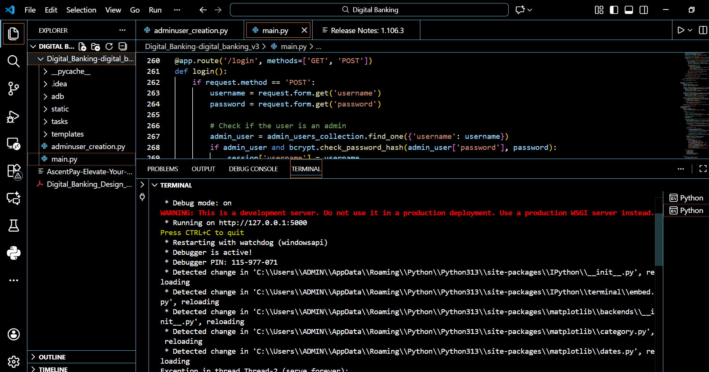
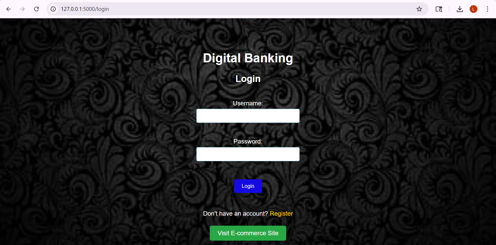
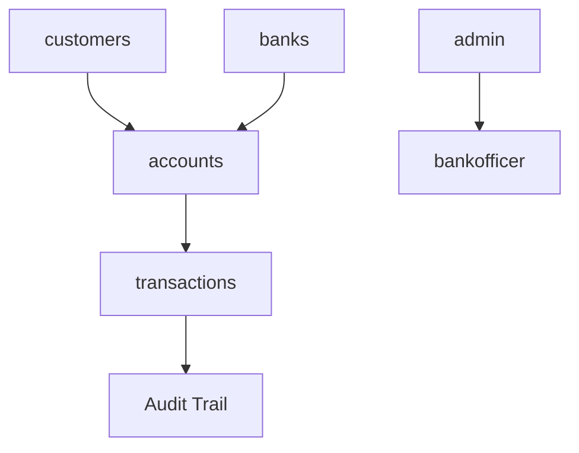
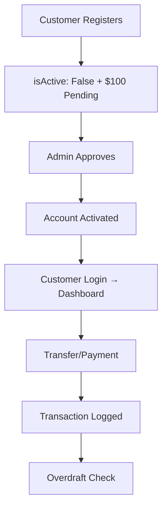
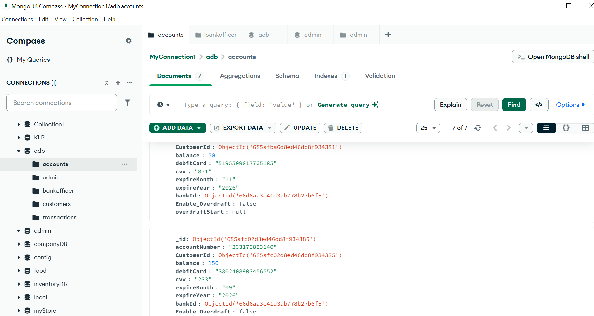

# 🚀 AscentPay: Digital Banking Management Information System (MIS)

**AscentPay** is a production-ready, multi-role **Management Information System (MIS)** that simulates complete digital banking operations. Built with Flask + MongoDB, it delivers secure account management, real-time transaction processing, and comprehensive admin oversight for modern banking workflows.

[](output1.PNG) [](output-2.PNG)

## ✨ Core Features

| Feature | Description |
|---------|-------------|
| **🔐 Multi-Role Authentication** | Customer, Bank Officer, Admin dashboards with bcrypt + sessions 
| **📋 Full CRUD Operations** | Create/Read/Update/Delete across 6 data structures 
| **⚙️ Auto Account Generation** | 12-digit accounts, 16-digit cards, CVV, expiry on registration
| **✅ Admin Approval Workflow** | `isActive: False` → Manual activation + $100 deposit 
| **💸 P2P Transfers** | Real-time validation + overdraft protection 
| **🛡️ Overdraft System** | $1,000 limit, $35 fee after 24h negative balance 
| **🛒 E-commerce Payments** | Full debit card validation (CVV/expiry/name) 
| **📊 Transaction Audit Trail** | Immutable logs with timestamps + types 

## 🛠️ Modern Tech Stack

| Component | Technology | Version | Purpose |
|-----------|------------|---------|---------|
| **Backend** | Python Flask | Latest | REST API + Business Logic |
| **Database** | MongoDB | 4.0+ | NoSQL Document Storage |
| **Security** | Flask-Bcrypt | Latest | Password Hashing |
| **Sessions** | Flask-Session | Latest | Secure State Management |
| **Frontend** | HTML/CSS + Jinja2 | Latest | Responsive UI |
| **Database** | PyMongo | Latest | MongoDB Driver |

## 🗄️ Database Architecture

**Database**: `adb` (6 Collections)



| Collection | Records | Key Fields | Operations |
|------------|---------|------------|------------|
| `customers` | Profiles | `username`, `ssn`, `isActive` | CRUD |
| `accounts` | Balances | `accountNumber`, `balance`, `debitCard` | RU |
| `transactions` | Logs | `amount`, `type`, `dateTime` | CR |
| `admin` | Admins | `username`, `password` | R |
| `bankofficer` | Officers | `name`, `ssn` | R |
| `banks` | Banks | `name`, `_id` | R |

## 🚀 Quick Start (5 Minutes)

### Prerequisites
```bash
# Required
Python 3.8+ ✅
MongoDB localhost:27017 ✅
pip ✅
```

### 1️⃣ Setup
```bash
git clone https://github.com/Lohith-kowkuntla/Digital-Banking-System.git
cd Digital-Banking-System/Digital_Banking-digital_banking_v3
pip install flask pymongo flask-bcrypt
```

### 2️⃣ Initialize
```bash
# Create default admin
python adminuser_creation.py
```

### 3️⃣ Launch
```bash
python main.py
```

**🌐 Access**: [http://localhost:5000/login](http://localhost:5000/login)

### 🆔 Default Credentials

| Role | Username | Password | Dashboard |
|------|----------|----------|-----------|
| 👑 **Admin** | `admin` | `admin123` | `/admin_dashboard` |
| 👤 **Customer** | `andy` | `password` | `/dashboard` |
| 🏦 **Bank Officer** | `Officer1` | `password` | `/bankofficer_dashboard` |

> ⚠️ **CHANGE ADMIN PASSWORD IMMEDIATELY** after first login!

## 🔄 Complete User Workflows



### 1. **Customer Journey**
1. Register → Auto account creation
2. Admin approval → $100 deposit
3. Login → View balance/transactions
4. Transfer funds → P2P validation
5. E-commerce payments → Card processing

### 2. **Admin Journey**
1. Approve pending users
2. Manage users (CRUD)
3. Monitor transactions
4. Deposit funds
5. Add bank officers

## 🎯 Advanced Features

### 💳 **Overdraft Protection**
```python
if balance < 0 and overdraft_enabled:
    if (now - overdraftStart) > 24h:
        balance -= 35  # $35 fee
        overdraftStart = now
```

### 🛒 **Payment Gateway Simulation**
- Full card validation (name/CVV/expiry)
- Balance + overdraft check
- Success/failure handling
- Transaction audit

## 📁 Repository Structure
```
Digital_Banking-digital_banking_v3/
├── main.py                    # 🎯 Main Flask App (22 Routes)
├── adminuser_creation.py      # 👤 Admin Seeding
├── templates/                 # 🖥️ 15+ HTML Views
├── static/                    # 🎨 CSS/JS/Images
├── tasks/                     # ⚙️ Background Jobs
└── .idea/                     # 💻 PyCharm Config
```

## 🔒 Security Implementation
- ✅ Bcrypt password hashing
- ✅ Session-based auth
- ✅ Input validation (SSN, amounts)
- ✅ SQL/NoSQL injection prevention
- ✅ CSRF protection via Flask

## 📊 API Endpoints (22 Total)

| Method | Endpoint | Role | Purpose |
|--------|----------|------|---------|
| POST | `/register` | Public | Customer signup |
| POST | `/login` | Public | Multi-role login |
| POST | `/transfer` | Customer | P2P transfers |
| POST | `/process_payment` | Public | E-commerce |
| GET | `/admin_dashboard` | Admin | Stats overview |

## 🤝 Contributing

1. `git clone` + `pip install`
2. `git checkout -b feature/xyz`
3. Code + tests
4. `git push` + PR

## 📄 License
MIT License - Free to use/modify/distribute.

---

**⭐ Star if useful!** | **🐛 Issues welcome** | **💼 Production ready**



**Built with ❤️ by Lohith Kowkuntla**
